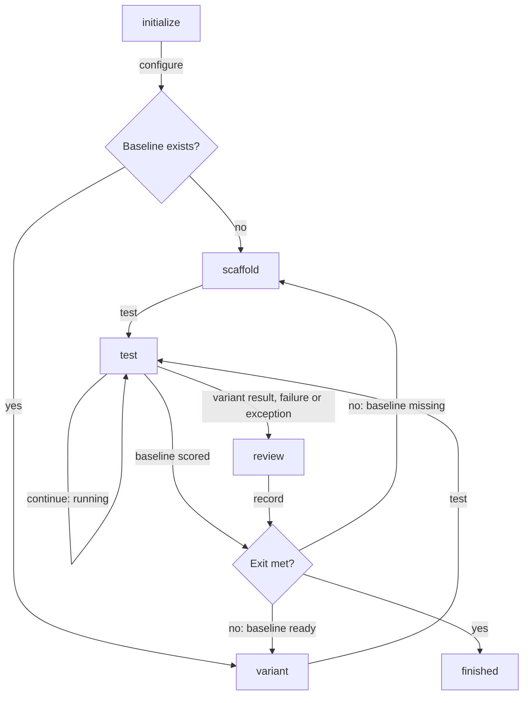
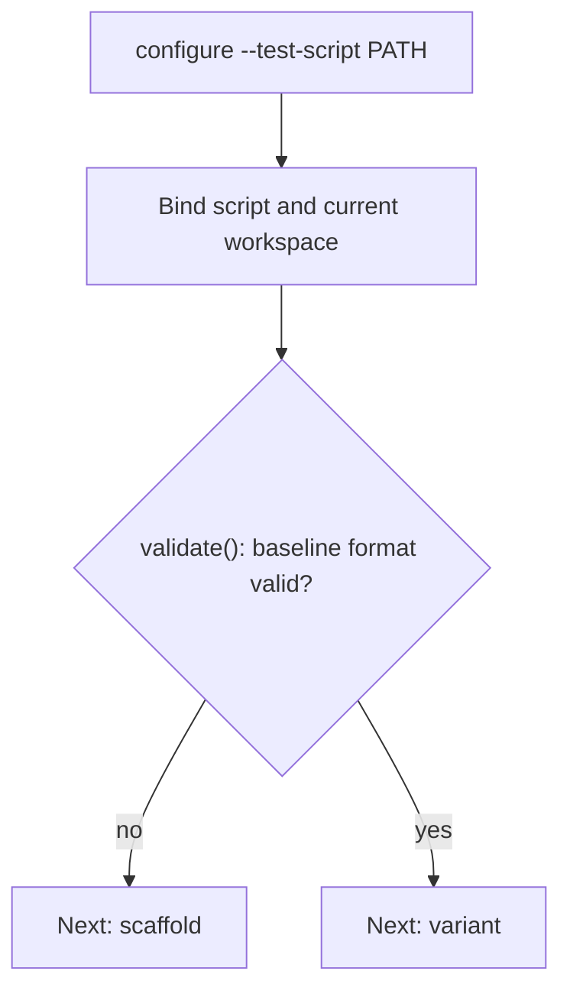
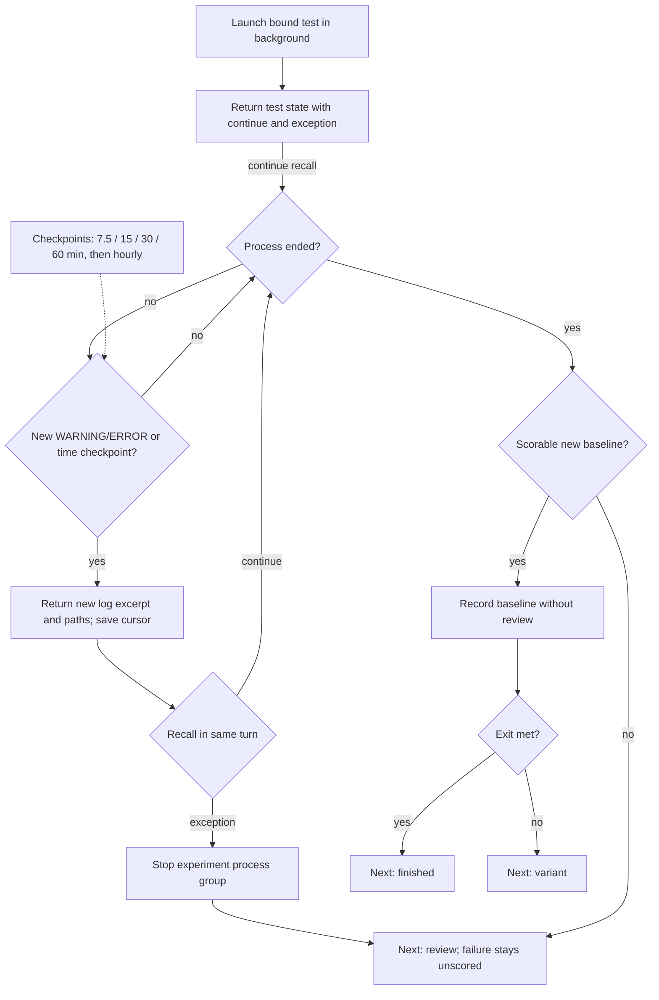
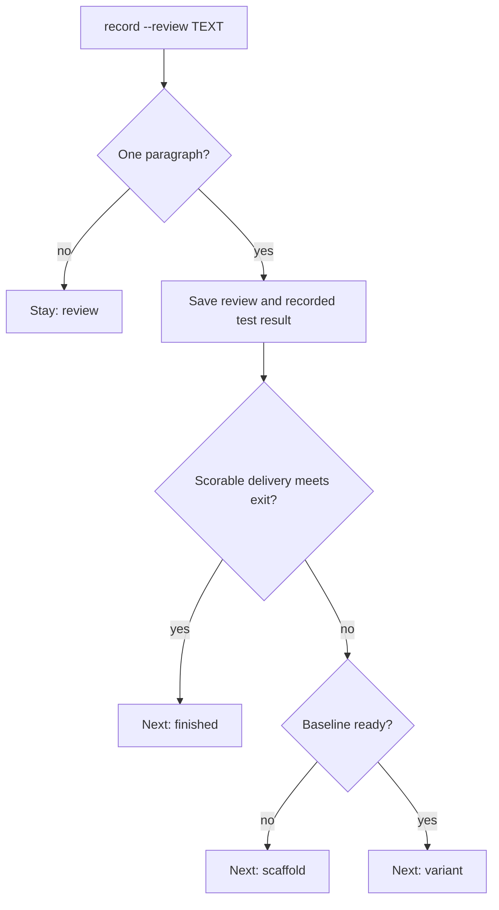
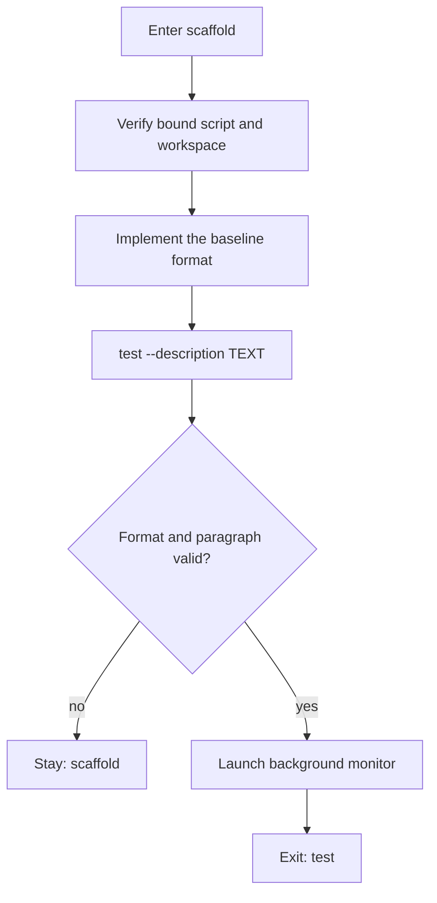
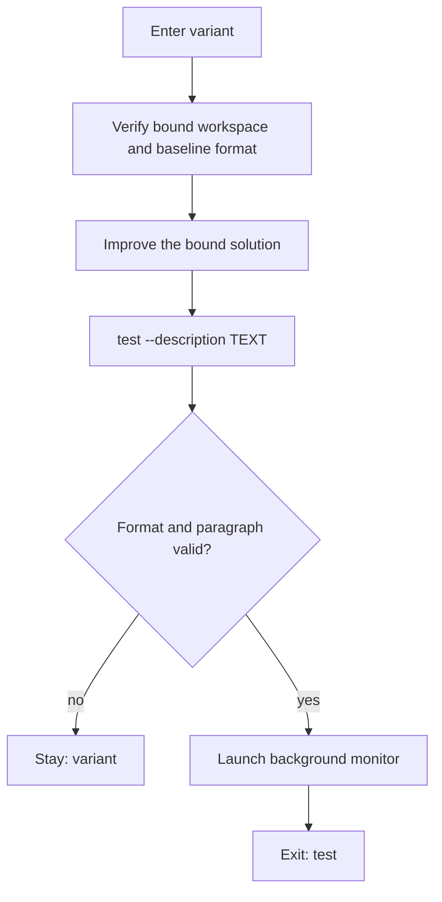
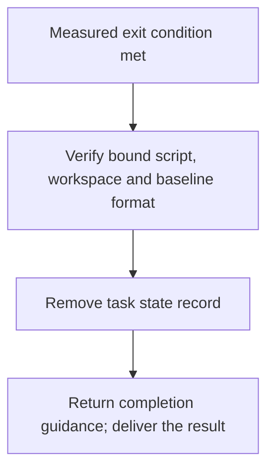

```mermaid
flowchart TD
    initialize -->|configure| baseline{Baseline exists?}
    baseline -->|no| scaffold
    baseline -->|yes| variant
    scaffold -->|test| test
    variant -->|test| test
    test -->|continue: running| test
    test -->|variant result, failure or exception| review
    test -->|baseline scored| exit{Exit met?}
    review -->|record| exit
    exit -->|yes| finished
    exit -->|no: baseline missing| scaffold
    exit -->|no: baseline ready| variant
```

**State: `initialize`**

```mermaid
flowchart TD
    configure["configure --test-script PATH"] --> bind[Bind script and current workspace]
    bind --> valid{"validate(): baseline format valid?"}
    valid -->|no| scaffold["Next: scaffold"]
    valid -->|yes| variant["Next: variant"]
```

**State: `test`**

```mermaid
flowchart TD
    enter[Launch bound test in background] --> returned[Return test state with continue and exception]
    returned -->|continue recall| poll{Process ended?}
    poll -->|no| trigger{"New WARNING/ERROR or time checkpoint?"}
    trigger -->|no| poll
    trigger -->|yes| output[Return new log excerpt and paths; save cursor]
    output --> recall{Recall in same turn}
    recall -->|continue| poll
    recall -->|exception| stop[Stop experiment process group]
    stop --> review["Next: review; failure stays unscored"]
    poll -->|yes| result{Scorable new baseline?}
    result -->|no| review
    result -->|yes| save[Record baseline without review]
    save --> exit{Exit met?}
    exit -->|yes| finished["Next: finished"]
    exit -->|no| variant["Next: variant"]
    checkpoints["Checkpoints: 7.5 / 15 / 30 / 60 min, then hourly"] -.-> trigger
```

**State: `review`**

```mermaid
flowchart TD
    record["record --review TEXT"] --> paragraph{One paragraph?}
    paragraph -->|no| stay["Stay: review"]
    paragraph -->|yes| save[Save review and recorded test result]
    save --> exit{Scorable delivery meets exit?}
    exit -->|yes| finished["Next: finished"]
    exit -->|no| baseline{Baseline ready?}
    baseline -->|no| scaffold["Next: scaffold"]
    baseline -->|yes| variant["Next: variant"]
```

State: scaffold

```mermaid
flowchart TD
    entry[Enter scaffold] --> precheck[Verify bound script and workspace]
    precheck --> implement[Implement the baseline format]
    implement --> test["test --description TEXT"]
    test --> valid{Format and paragraph valid?}
    valid -->|no| scaffold[Stay: scaffold]
    valid -->|yes| launch[Launch background monitor]
    launch --> monitor[Exit: test]
```

State: variant

```mermaid
flowchart TD
    entry[Enter variant] --> precheck[Verify bound workspace and baseline format]
    precheck --> improve[Improve the bound solution]
    improve --> test["test --description TEXT"]
    test --> valid{Format and paragraph valid?}
    valid -->|no| variant[Stay: variant]
    valid -->|yes| launch[Launch background monitor]
    launch --> monitor[Exit: test]
```

State: finished

```mermaid
flowchart TD
    entry[Measured exit condition met] --> precheck[Verify bound script, workspace and baseline format]
    precheck --> remove[Remove task state record]
    remove --> delivery[Return completion guidance; deliver the result]
```
